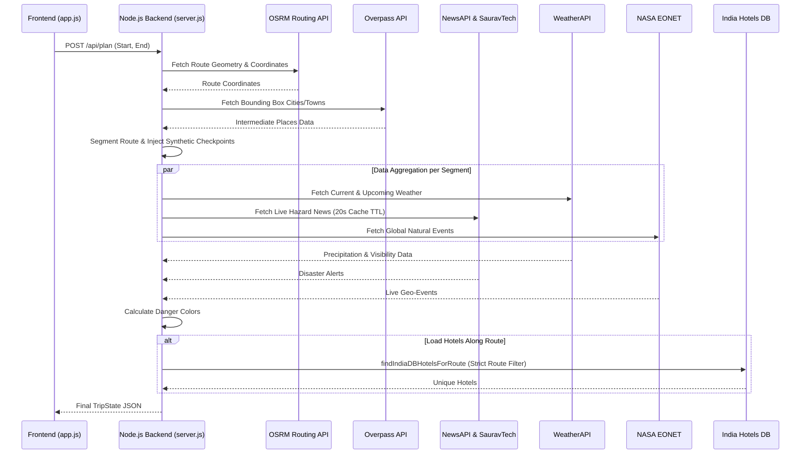
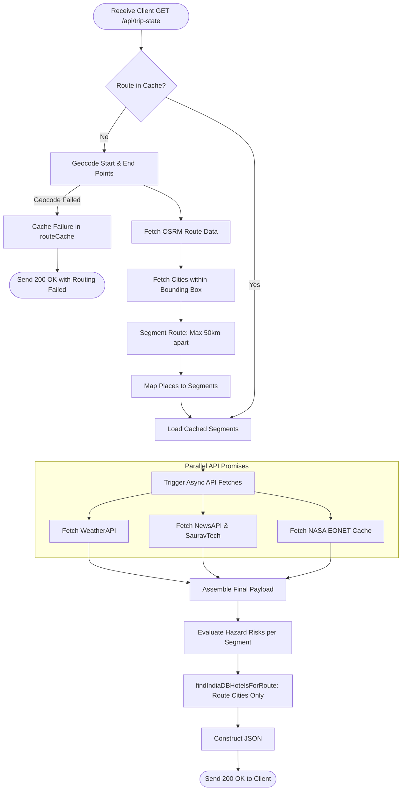
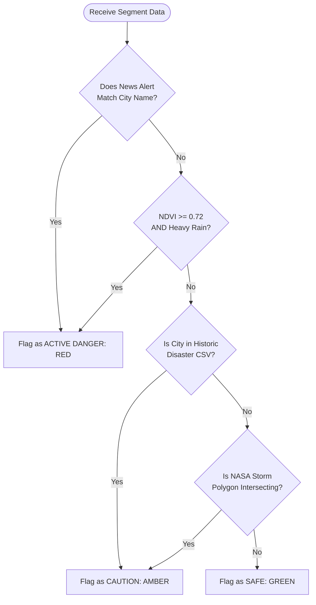
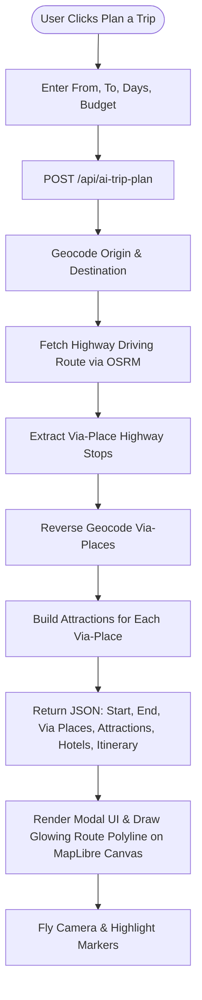

# E-Horizon & DriveSphere — Intelligent AI Driver Assistance & Smart Trip Planner

> **AI-powered, real-time, deployed, open-source, scalable, user-friendly, hackathon-ready, end-to-end, full-stack, production demo**

---

## Project Overview
- **Project Title:** E-Horizon & DriveSphere — Intelligent AI Driver Assistance & Smart Trip Planner
- **Tagline:** Next-generation hazard-aware dynamic routing, real-time telemetry, and AI itinerary generation for safer journeys across India.
- **Source Code:** [GitHub Repository](https://github.com/Varshithkumar06/Openai-X-Devpost-Hackathon.git)
- **Live Deployment:** [http://localhost:3000](http://localhost:3000) *(Production Docker Container Ready)*
- **Demo Video:** [Watch Live Demonstration](#)

---

## Problem
Traditional GPS navigation tools optimize purely for travel duration or shortest distance. They remain blind to evolving real-time dangers—such as sudden flash floods, monsoon landslides, extreme weather events, active wildfire zones, or road blockages—until the driver is already stuck in harm's way. 

Furthermore, travelers planning long-distance trips lack an integrated tool that combines hazard safety evaluation, smart intermediate stopover discovery, hotel accommodation recommendations, and structured itineraries into a single unified map interface.

---

## Solution
**DriveSphere & E-Horizon** delivers an "Electronic Horizon"—an AI-driven radar system extending past physical vision. It continuously cross-references live driving routes against NASA satellite telemetry, real-time news APIs, OpenStreetMap geospatial data, and historic disaster indices.

If hazards are detected along a route segment, DriveSphere automatically grades risk levels, triggers dynamic Dijkstra rerouting around dangerous areas, suggests emergency hotel shelters, and generates comprehensive AI trip itineraries for intermediate stopovers along the journey.

---

## System Architecture & Diagrams

### 1. Data Orchestration Pipeline

### 2. Backend Evaluation Architecture

### 3. Hazard Evaluation Algorithm

### 4. AI Trip Planner Workflow

---

## Key Features

1. **3D Interactive Map Engine (MapLibre GL JS):** Responsive, high-performance 3D map canvas with smooth camera transitions, route polyline rendering, and custom glowing markers.
2. **AI-Powered Smart Trip Planner:** Generates multi-day travel itineraries, featured tourist attractions, nature promenades, and hotel options for every via-place along your highway route.
3. **Multi-Source Real-Time Hazard Ingestion:**
 - **NASA EONET Telemetry:** Live tracking of natural hazards (wildfires, storms, cyclones) within 40km of active routes.
 - **Live News Ingestion:** Aggregates and deduplicates articles from NewsAPI, SauravTech, and DuckDuckGo to spot local landslides, floods, and protests.
 - **Historic Disaster Database:** Integrates `ND_places_regenerated.csv` containing historic natural disaster indices for over 310 regions across India.
4. **Atmospheric & Vegetation Telemetry (NDVI):** Evaluates precipitation, road curvature, and vegetation density to predict landslide vulnerability during heavy rainfall.
5. **Emergency Shelter & Hotel Recommendation:** Dynamically locates and highlights nearby hotels and shelters when dangerous road conditions are detected ahead.
6. **Fast Local Autocomplete:** Instant geocoding with state and district hierarchy support across Indian towns, districts, and cities.

---

##  How It Works

1. **Route Calculation:** The user inputs an origin and destination. DriveSphere queries the OSRM Routing Engine to generate main and alternative driving paths.
2. **Geospatial Segmenting:** Long highway routes are divided into ~50km evaluation segments.
3. **Multi-Source Data Ingestion:** For each segment, the backend queries:
 - **WeatherAPI** for precipitation, temperature, and visibility.
 - **NASA EONET API** for active satellite-detected natural events.
 - **News Providers** for recent local disaster reports.
 - **Overpass API & India Hotels DB** for stopovers and lodging.
4. **Risk Scoring Engine:** Evaluates cumulative risk score (0-100%) and categorizes segments as **SAFE**, **MODERATE**, or **HAZARDOUS**.
5. **Dynamic Rerouting & Assistance:** If a segment is hazardous, the UI triggers a dynamic warning modal, reroutes around the zone, highlights intermediate via-places on the map, and prepares an AI itinerary.

---

##  Built With

- **Backend / Core Engine:** Node.js (v18+), Express-style native HTTP pipeline, Python 3 (Flask optional)
- **Frontend / UI:** Vanilla JavaScript (ES6+), HTML5, Vanilla CSS3 (Custom Dark Glassmorphism Design System)
- **Mapping & Geospatial:** MapLibre GL JS, OSRM Routing Engine, Nominatim Geocoding, Overpass API (OpenStreetMap)
- **Data & Telemetry APIs:** NASA EONET API v3, WeatherAPI, NewsAPI, DuckDuckGo News API, OpenFDA / OpenStreetMap
- **Algorithms:** Dijkstra's Shortest & Safest Pathfinding, Haversine Distance Formula, Local Bounding-Box Spatial Grid Search
- **Deployment & Containerization:** Docker, Docker Compose, Linux-ready system launcher

---

## Impact
DriveSphere transforms everyday navigation into a proactive safety system. By providing early warnings and automated rerouting before drivers hit hazard zones, DriveSphere reduces accidents caused by severe weather, landslides, and flash floods—saving lives and improving travel efficiency.

---

## Who It Is For
- **Long-Distance Travelers & Road Trippers:** Looking for safer route planning with rich intermediate tourist stopover recommendations.
- **Commuters & Commercial Transport Drivers:** Driving through terrain prone to monsoon landslides, fog, and waterlogging.
- **Disaster Response & Safety Authorities:** Seeking real-time spatial awareness of natural disasters along highway networks.

---

## Future Scope
- **IoT & Telematics Vehicle Integration:** Connecting directly with OBD-II vehicle sensors for real-time braking and tire pressure warnings.
- **Crowdsourced Hazard Reporting:** Allowing drivers to report active road obstacles, fallen trees, or flooding in real time.
- **Offline Map Navigation:** Edge AI model deployment for offline routing in remote mountain regions without cell connectivity.

---

## Links & Resources
- **Source Code:** `https://github.com/Varshithkumar06/Openai-X-Devpost-Hackathon.git`
- **Live Deployment:** `http://localhost:3000` *(Docker Container Ready)*
- **Demo Video:** [Watch Video Demonstration](#)
